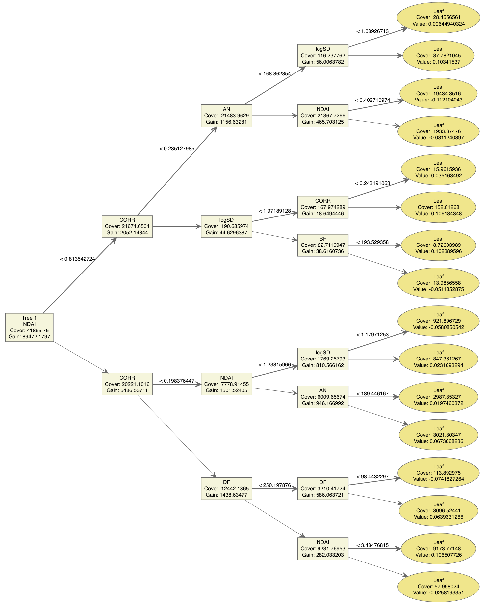

```{r setup, include=FALSE}
knitr::opts_chunk$set(echo = F, cache = F, warning = F, message = F)
library(mosaic)
library(caret)
library(gridExtra)
library(kableExtra)
library(GGally)
library(ggcorrplot)
library(corrplot)
library(MASS)
library(e1071)
library(class)
library(tree)
library(MLmetrics)
library(randomForest)
library(gbm)
library(xgboost)
library(pROC)
ggplot2::theme_set(ggplot2::theme_bw())
knitr::opts_chunk$set(fig.align = 'center')
knitr::opts_chunk$set(fig.pos = "H")

image_1 <- read.table("image_data/imagem1.txt")
image_2 <- read.table("image_data/imagem2.txt")
image_3 <- read.table("image_data/imagem3.txt")
var_name <- c("Y_coord", "X_coord", "Cloud", "NDAI", "SD", "CORR", "DF","CF","BF","AF","AN")
colnames(image_1) = colnames(image_2) = colnames(image_3) <- var_name
image_1$Cloud <- factor(image_1$Cloud)
image_2$Cloud <- factor(image_2$Cloud)
image_3$Cloud <- factor(image_3$Cloud)
image_1$logSD <- log(image_1$SD)
image_2$logSD <- log(image_2$SD)
image_3$logSD <- log(image_3$SD)
Image_1 <- image_1 %>% filter(Cloud != "0") %>% mutate(Cloud = factor(Cloud))
Image_2 <- image_2 %>% filter(Cloud != "0") %>% mutate(Cloud = factor(Cloud))
Image_3 <- image_3 %>% filter(Cloud != "0") %>% mutate(Cloud = factor(Cloud))
All_Image <- rbind(Image_1, Image_2, Image_3)

load("Image_all_Cut.RData")
load("Image_all_KM.RData")
Image_Train_Cut <- Image_all_Cut %>%  filter(Type != "Test")
Image_Test_Cut <- Image_all_Cut %>%  filter(Type == "Test")
Image_Train_KM <- Image_all_KM %>%  filter(Type != "Test")
Image_Test_KM <- Image_all_KM %>%  filter(Type == "Test")
```


\section{Data Collection and Exploration}


\subsection{Background \& Motivation}

<!-- (a) Write a half-page summary of the paper, including at least the purpose of the study, the data, the collection method, its conclusions and potential impact. -->

With the global climates getting increasingly extreme, humans are making the best use of sciences and technologies to understand the environment, especially in the Arctic region. 
The detection of clouds in satellite images has become an important task, as cloud coverage is closely related to the surface air temperatures and atmospheric carbon dioxide levels. Yet it is a challenging problem since clouds are similar on snow- and ice-covered surfaces.
In this study, we are going to examine various classification methods, build reliable models that distinguish the presence of cloud from Arctic satellite images using available features and evaluate our models' performance. 

The data is obtained from a study by @yu2008. This team of researchers collected the data via the camera of Multiangle Imaging SpectroRadiometer (MISR) launched by the NASA. The data are in the forms of image pixels, with each MISR pixel covering a 275 m by 275 m region on the ground. 
Since standard classification frameworks of clouds were not readily applicable, their goal was also to build operational cloud detection algorithms that can efficiently process the massive MISR data set one data unit at a time without requiring human intervention or expert labeling. 

@yu2008 proposed two algorithms, an enhanced linear correlation matching (ELCM) algorithm based on thresholding the three features with values either fixed or data-adaptive, and an ELCM algorithm with Fisher’s quadratic discriminant analysis (ELCM-QDA). 

Their results suggest that both proposed algorithms are computationally efficient for operational processing of the massive MISR data sets. The accuracy and coverage of ELCM are better and more informative compared with conventional MISR operational algorithms. These findings provide important implications and foundations for further analysis of MISR data. 


\subsection{Data Description}

<!-- (b) Summarize the data, i.e., % of pixels for the different classes. Plot well-labeled beautiful maps using x, y coordinates the expert labels with color of the region based on the expert labels. Do you observe some trend/pattern? Is an i.i.d. assumption for the samples justified for this dataset? -->

```{r show map, fig.cap="\\label{fig:map3}Maps of three images with expert labels. White represents high confidence of cloud; gray represents high confidence of clear; and dark represents unlabeled pixels.",fig.width = 12, fig.height = 4, out.width="85%"}
# Palette_1 <- c("gray","black", "white")
# 
# map_1 <- image_1 %>%
#   ggplot() + geom_point(aes(x = X_coord, y = Y_coord, color = Cloud), size = 0.5) +
#   theme_map() + theme(legend.position = "none") +
#   labs(title = "Image 1", x = "X Coordinate", y = "Y Coordinate") +
#   scale_colour_manual(values = Palette_1)
# 
# map_2 <- image_2 %>%
#   ggplot() + geom_point(aes(x = X_coord, y = Y_coord, color = Cloud), size =  0.5) +
#   theme_map() + theme(legend.position = "none") +
#   labs(title = "Image 2", x = "X Coordinate", y = "Y Coordinate") +
#   scale_colour_manual(values = Palette_1) 
# 
# map_3 <- image_3 %>%
#   ggplot() + geom_point(aes(x = X_coord, y = Y_coord, color = Cloud), size = 0.5) +
#   theme_map() + theme(legend.position = "none") +
#   labs(title = "Image 3", x = "X Coordinate", y = "Y Coordinate") +
#   scale_colour_manual(values = Palette_1)
# 
# grid.arrange(arrangeGrob(map_1 + ggeasy::easy_center_title() + theme(legend.position="none"),
#                          map_2 + ggeasy::easy_center_title() + theme(legend.position="none"),
#                          map_3 + ggeasy::easy_center_title() + theme(legend.position="none"),
#                          nrow = 1))

Palette_2 <- c("gray", "white")

map1 <- image_1 %>%
  filter(Cloud != 0) %>%
  ggplot() + geom_point(aes(x = X_coord, y = Y_coord, color = Cloud), size = 0.5) +
  theme_dark() + labs(title = "Image 1", x = "X Coordinate", y = "Y Coordinate") +
  scale_colour_manual(values = Palette_2)

map2 <- image_2 %>%
  filter(Cloud != 0) %>%
  ggplot() + geom_point(aes(x = X_coord, y = Y_coord, color = Cloud), size = 0.5) +
  theme_dark() + labs(title = "Image 2", x = "X Coordinate", y = "Y Coordinate") +
  scale_colour_manual(values = Palette_2)

map3 <- image_3 %>%
  filter(Cloud != 0) %>%
  ggplot() + geom_point(aes(x = X_coord, y = Y_coord, color = Cloud), size = 0.5) +
  theme_dark() + labs(title = "Image 3", x = "X Coordinate", y = "Y Coordinate") +
  scale_colour_manual(values = Palette_2)

map_legend <- lemon::g_legend(map1 +  guides(colour = guide_legend(nrow = 1)))

grid.arrange(arrangeGrob(map1 + ggeasy::easy_center_title() + theme(legend.position="none"),
                         map2 + ggeasy::easy_center_title() + theme(legend.position="none"),
                         map3 + ggeasy::easy_center_title() + theme(legend.position="none"),
                         nrow = 1),
             map_legend, nrow = 2, heights = c(10, 1))
```
In this study, we primarily focus on three of the MISR images. These three images contain 115110, 115229 and 115217 pixels respectively. However, not all pixels are labeled with confident experts' classification. As shown in in Figure \ref{fig:map3}, there are considerable portions of images not labeled. We notice the pattern that usually experts have difficulties distinguishing the areas around what they recognize as clouds. It is understandable that the borderlands between cloudy and clear surfaces are more challenging to determine. 

We can also observe that labeled clouds are often clustered in chunks. Therefore, adjacent pixels' labels are not independent and instead seem to have very high positive correlations. For example, if a pixel's neighbors are all labeled as clouds, it is highly likely that it is also labeled as part of the cloud. 

In Table 1, we present the percentages of expert labels in each image.
Since we have no confident expert opinion on unlabeled pixels, they are viewed as missing / unknown values. 
After removing unlabeled pixels, we have 82148, 70917 and 54996 pixels in each image, with available information (labels and features). 

```{r}
t1 <- image_1 %>% summarise(`Cloud Labels` = mean(Cloud == "1"), `Clear Labels` = mean(Cloud == "-1"), `Unknown` = mean(Cloud == "0")) %>% mutate(Image = "1")

t2 <- image_2 %>% summarise(`Cloud Labels` = mean(Cloud == "1"), `Clear Labels` = mean(Cloud == "-1"), `Unknown` = mean(Cloud == "0")) %>% mutate(Image = "2")

t3 <- image_3 %>% summarise(`Cloud Labels` = mean(Cloud == "1"), `Clear Labels` = mean(Cloud == "-1"), `Unknown` = mean(Cloud == "0")) %>% mutate(Image = "3")

knitr::kable(rbind(t1, t2, t3),
    caption = "Proportions of Cloudy and Clear Surfaces by Expert Labeling",
    booktabs = T ) %>%
  kable_styling(latex_options = "HOLD_position", position = "center", font_size = 8)
```


In specific, each pixel has eight features. The first three are physically useful features for characterizing the scattering properties of ice and snow covered surfaces: the correlation (`CORR`) of MISR images of the same scene from different MISR viewing directions, the standard deviation (`SD`) of MISR nadir camera pixel values across a scene, and a normalized difference angular index (`NDAI`) that characterizes the changes in a scene with changes in the MISR view direction.

The latter five are five view zenith angles of the cameras. $70.5^{\circ}$ (DF), $60.0^{\circ}$ (CF), $45.6^{\circ}$ (BF), and $26.1^{\circ}$ (AF) in the forward direction and $0.0^{\circ}$ (AN) in the nadir direction. 


\subsection{Exploratory Data Analysis}

<!-- (c) Perform a visual and quantitative EDA of the dataset, e.g., summarizing (i) pair- wise relationship between the features themselves and (ii) the relationship between the expert labels with the individual features. Do you notice differences between the two classes (cloud, no cloud) based on the radiance or other features (CORR, NDAI, SD)? -->

Conducting a EDA on the available features gives a preliminary picture of the relationship within potential predictors as well as with the response. First of all, we notice in Figure \ref{fig:corrplot} that there is positive correlation between the features. The correlation is particularly strong and positive among the five radiance angles. For example, `BF`, `AF` and `AN` are very strongly correlated. We also see positive correlations between `NADI`, `CORR` and `SD`.

However, the correlations between the first three features (`NADI`, `CORR` and `SD`) and five radiance angles (`Df`, `CF`, `BF`, `AF`, `AN`) are mostly negative.

```{r pariwise covariate, fig.cap="\\label{fig:corrplot} Pair-wise correlations between eight available features.", out.width="45%"}
All_Image |>
dplyr::select(-Y_coord, -X_coord, -Cloud) |>
cor() |>
ggcorrplot(hc.order = TRUE)

# All_Image %>% 
# dplyr::select(-Y_coord, -X_coord, -Cloud) %>% 
#   cor(use="pairwise.complete.obs") %>% 
#   ggcorrplot(show.diag = F, type="lower", lab=TRUE, lab_size=2)
```

Figure \ref{fig:hist_cov} shows that for pixels labeled as cloud, their `NADI`, `CORR` and `SD` are likely to be higher than those labeled as no cloud. This distinct pattern provides strong support to use these features as predictors of our classification models. It also seems reasonable to have a log transformation of `SD` so that it is in a similar scale as other features. 

```{r hist covariate, fig.cap="\\label{fig:hist_cov}Density distributions of three features that describe cloud and clear pixels.", fig.width=9, fig.height=3.3, out.width="92%"}
hist_1 <- All_Image %>% 
  ggplot(aes(x = NDAI )) +
  geom_density(aes(fill = Cloud, color = Cloud), alpha = 0.7) 

hist_2 <- All_Image %>% 
  ggplot(aes(x = CORR )) +
  geom_density(aes(fill = Cloud, color = Cloud), alpha = 0.7) 

hist_3 <- All_Image %>% 
  ggplot(aes(x = SD )) +
  geom_density(aes(fill = Cloud, color = Cloud), alpha = 0.7) 

hist_4 <- All_Image %>% 
  ggplot(aes(x = log(SD) )) +
  geom_density(aes(fill = Cloud, color = Cloud), alpha = 0.7) 

grid.arrange(hist_1 + ggeasy::easy_center_title(),
             hist_2 + ggeasy::easy_center_title(),
             hist_3 + ggeasy::easy_center_title(),
             hist_4 + ggeasy::easy_center_title(),
             nrow = 2)
```

In terms of other features, we can see that the density distributions of radiance angles of cloud and cloud-free pixels are pretty consistent across angles in Figure \ref{fig:hist_cov2}. The radiance angles of cloud pixels are usually wider and right skewed, whereas the radiance angles of cloud-free pixels are usually higher and distributed in a bimodal shape. The distributions between cloud and cloud-free pixels are not as separable and distinct as the first three features. 

```{r hist covariate2, fig.cap="\\label{fig:hist_cov2}Density distributions of radiance angles from cloud and clear pixels.", fig.width=10, fig.height=3}
hist_1 <- All_Image %>% 
  ggplot(aes(x = DF )) +
  geom_density(aes(fill = Cloud, color = Cloud), alpha = 0.7) 

hist_2 <- All_Image %>% 
  ggplot(aes(x = CF )) +
  geom_density(aes(fill = Cloud, color = Cloud), alpha = 0.7) 

hist_3 <- All_Image %>% 
  ggplot(aes(x = BF )) +
  geom_density(aes(fill = Cloud, color = Cloud), alpha = 0.7) 

hist_4 <- All_Image %>% 
  ggplot(aes(x = AF )) +
  geom_density(aes(fill = Cloud, color = Cloud), alpha = 0.7) 

hist_5 <- All_Image %>% 
  ggplot(aes(x = AN )) +
  geom_density(aes(fill = Cloud, color = Cloud), alpha = 0.7) 


grid.arrange(hist_1 + ggeasy::easy_center_title(),
             hist_2 + ggeasy::easy_center_title(),
             hist_3 + ggeasy::easy_center_title(),
             hist_4 + ggeasy::easy_center_title(),
             hist_5 + ggeasy::easy_center_title(),
             nrow = 2)
```


\section{Preparation}

<!-- (a) (Data Split) Split the entire data (imagem1.txt, imagem2.txt, imagem3.txt) into three sets: training, validation and test. Think carefully about how to split the data. Suggest at least two non-trivial different ways of splitting the data which takes into account that the data is not i.i.d. -->

\subsection{Data Splitting}
Before building models, it is important to prepare the data as training, validation and testing sets so that we can make the best use of the data and evaluate our models.
The key idea of our data splitting is to take into account the fact that this data set is not i.i.d. Therefore, we propose the two following ways of dividing data into blocks. 


**Method 1. Horizontal Cuts**: The first method cuts each image horizontally in order to ensure that every resulting block has a reasonable portion of clouds and clear surfaces. 
Basically, each image is cut into five blocks by evenly dividing Y coordinates (shown in Figure \ref{fig:cut_split}), and three of them would be used as training data, the rest two blocks are used as validation and testing respectively.
This method splits the data into 58.59% training data, 19.03% validation data and 22.38% testing data (roughly 3:1:1). 

```{r split 1, fig.cap="\\label{fig:cut_split}The first data splitting method is to divide each image horizontally.", fig.width=12, fig.height=4, out.width="90%"}
seperate_fold <- function(train_data) {
  
  fold_1 <- train_data %>% filter( Y_coord  < 383*0.2 )
  fold_2 <- train_data %>% filter( 383*0.2 <= Y_coord, Y_coord  < 383*0.4 )
  fold_3 <- train_data %>% filter( 383*0.4 <= Y_coord, Y_coord  < 383*0.6 )
  fold_4 <- train_data %>% filter( 383*0.6 <= Y_coord, Y_coord  < 383*0.8 )
  fold_5 <- train_data %>% filter( 383*0.8 <= Y_coord )
  
return( rbind(fold_1 %>% mutate(Type = "Train"),
      fold_2 %>% mutate(Type = "Train"),
      fold_3 %>% mutate(Type = "Train"),
      fold_4 %>% mutate(Type = "Test"),
      fold_5 %>% mutate(Type = "Validation") ) ) 
}

Cut_1 <- seperate_fold(Image_1)
Cut_2 <- seperate_fold(Image_2)
Cut_3 <- seperate_fold(Image_3)


Cut_1_Map <- Cut_1 %>%
  ggplot() + geom_point(aes(x = X_coord, y = Y_coord, color = Type), size = 0.5) +
  labs(title = "Image 1", x = "X Coordinate", y = "Y Coordinate") 

Cut_2_Map <- Cut_2 %>%
  ggplot() + geom_point(aes(x = X_coord, y = Y_coord, color = Type), size = 0.5) +
  labs(title = "Image 2", x = "X Coordinate", y = "Y Coordinate")

Cut_3_Map <- Cut_3 %>%
  ggplot() + geom_point(aes(x = X_coord, y = Y_coord, color = Type), size = 0.5) +
  labs(title = "Image 3", x = "X Coordinate", y = "Y Coordinate") + theme(legend.position="none")


grid.arrange(arrangeGrob(Cut_1_Map + ggeasy::easy_center_title() + theme(legend.position="none"),
                         Cut_2_Map + ggeasy::easy_center_title() + theme(legend.position="none"),
                         Cut_3_Map + ggeasy::easy_center_title() + theme(legend.position="none"),
                         nrow = 1),
             lemon::g_legend(Cut_1_Map +  guides(colour = guide_legend(nrow = 1))), nrow = 2, heights = c(10, 1))

Image_all_Cut <- rbind(Cut_1, Cut_2, Cut_3)
```


**Method 2. K-means Clusters**: The second method of blocked data splitting is to use the K-means algorithm. By selecting a cluster size of five, we can divide each image's datapoints into five distinct groups (according to X-Y coordinates). Again, shown in Figure \ref{fig:kmean_split}, three of these are used for training data, one is for validation and the last one is for testing. The K-means method splits all datapoints into 60.72% training data, 20.04% validation data and 19.24% testing data. 

```{r split 2, fig.cap="\\label{fig:kmean_split}The second data splitting method is to divide based on the K-means algorithm.", fig.width=12, fig.height=4, out.width="90%"}
set.seed(8848)

KM_1 <- kmeans(Image_1[,1:2], centers = 5, nstart = 25)
KM_2 <- kmeans(Image_2[,1:2], centers = 5, nstart = 25)
KM_3 <- kmeans(Image_3[,1:2], centers = 5, nstart = 25)

Image_all_KM <- rbind(Image_1 %>% mutate(image = "1", cluster = KM_1$cluster),
                      Image_2 %>% mutate(image = "2", cluster = KM_2$cluster),
                      Image_3 %>% mutate(image = "3", cluster = KM_3$cluster))

Image_all_KM <- Image_all_KM %>% 
  mutate(Type = ifelse(cluster == "2", "Test", "Train"))  %>% 
  mutate(Type = ifelse(cluster == "5", "Validation", Type)) 

KM_1_Map <- Image_all_KM %>% filter(image == "1") %>% 
  ggplot() + geom_point(aes(x = X_coord, y = Y_coord, color = Type), size = 0.5) +
  theme_bw() + labs(title = "Image 1", x = "X Coordinate", y = "Y Coordinate") 

KM_2_Map <- Image_all_KM %>% filter(image == "2") %>% 
  ggplot() + geom_point(aes(x = X_coord, y = Y_coord, color = Type), size = 0.5) +
  theme_bw() + labs(title = "Image 2", x = "X Coordinate", y = "Y Coordinate") 

KM_3_Map <-Image_all_KM %>% filter(image == "3") %>% 
  ggplot() + geom_point(aes(x = X_coord, y = Y_coord, color = Type), size = 0.5) +
  theme_bw() + labs(title = "Image 3", x = "X Coordinate", y = "Y Coordinate") 

grid.arrange(arrangeGrob(KM_1_Map + ggeasy::easy_center_title() + theme(legend.position="none"),
                         KM_2_Map + ggeasy::easy_center_title() + theme(legend.position="none"),
                         KM_3_Map + ggeasy::easy_center_title() + theme(legend.position="none"),
                         nrow = 1),
             lemon::g_legend(KM_1_Map +  guides(colour = guide_legend(nrow = 1))), nrow = 2, heights = c(10, 1))
```

The table below describes how many cloud pixels there are in each set after two ways of data splitting. We think they are both reasonable in terms of having both cloud and clear pixels in every subset of data. 

```{r, eval = T}
# prop.table(table(Image_all_Cut$Type))
# prop.table(table(Image_all_KM$Type))

knitr::kable(
  cbind(
    Image_all_Cut %>%
      group_by(Type) %>%
      dplyr::summarise(`Cloud Prop` = mean(Cloud == "1")) %>%
      mutate(Method = "Horizontal Cuts"),
    Image_all_KM %>%
      group_by(Type) %>%
      dplyr::summarise(`Cloud Prop` = mean(Cloud == "1")) %>%
      mutate(Method = "K-means")
  )[,c(3,1,2,6,4,5)],
  caption = "Proportions of cloud pixels in each set",
  booktabs = T) %>%
  kable_styling(latex_options = "HOLD_position",
                position = "center",
                font_size = 8)
```


\subsection{Baseline Accuracy}

<!-- Report the accuracy of a trivial classifier which sets all labels to -1 (cloud-free) on the validation set and on the test set. In what scenarios will such a classifier have high average accuracy? Hint: Such a step provides a baseline to ensure that the classification problems at hand is not trivial. -->

We can examine the accuracy of a trivial classifier which sets all labels to -1 on the validation set and on the test set as shown in the table below. This classifier assumes that the image has no cloud pixels at all. Logically, the accuracy, or the success rate, of this trivial classifier depends entirely on the percentage of actual cloud free pixels labeled in the data. If the image is mostly cloud free, then labeling all points as -1 would easily achieve a high accuracy. 

```{r accuaracy of trival predictor}
cut_v <- Image_all_Cut %>% 
  filter(Type == "Validation")%>% 
  mutate(Predict = "-1") %>% 
  summarise(`Data Type` = "Validation", Accuracy = mean(Predict == Cloud)) %>% mutate(Method = "Horizontal Cuts")

cut_t <- Image_all_Cut %>% 
  filter(Type == "Test")%>% 
  mutate(Predict = "-1") %>% 
  summarise(`Data Type` = "Test", Accuracy = mean(Predict == Cloud)) %>% mutate(Method = "Horizontal Cuts")


km_v <- Image_all_KM %>% 
  filter(Type == "Validation")%>% 
  mutate(Predict = "-1") %>% 
  summarise(`Data Type` = "Validation", Accuracy = mean(Predict == Cloud)) %>% mutate(Method = "K-means")

km_t <- Image_all_KM %>% 
  filter(Type == "Test")%>% 
  mutate(Predict = "-1") %>% 
  summarise(`Data Type` = "Test", Accuracy = mean(Predict == Cloud)) %>% mutate(Method = "K-means")

knitr::kable(rbind(cut_v, cut_t, km_v, km_t)[,c(3,1,2)],
    caption = "Accuracy of a trivial classifier that sets all labels to -1",
    booktabs = T ) %>%
  kable_styling(latex_options = "HOLD_position", position = "center", font_size = 8)
```

Here it is shown that labeling all points as -1 can only achieve an accuracy of 66.15% and 67.04% on the test data sets, which shows that to achieve high accuracy in this classification problem is not trivially easy. This also sets a baseline of reference for our subsequent classification methods. 

\subsection{First order importance}

<!-- (c) (First order importance) Assuming the expert labels as the truth, and without using fancy classification methods, suggest three of the “best” features, using quantitative and visual justification. Define your “best” feature criteria clearly. Only the relevant plots are necessary. Be sure to give this careful consideration, as it relates to subsequent problems. -->

We consider `NADI`, `CORR` and `logSD` (notice that we apply a log transformation on `SD` as justified in section 1.3) as the three most important features when classifying pixels. Firstly, the EDA as shown in Figure \ref{fig:hist_cov} and \ref{fig:hist_cov2} has shown that the density distributions of the first three variables are more distinct between cloud and non-cloud pixels compared with the angular radiance variables. 

Then we also examine the pair-wise correlation between the response, `Cloud`, and each of the eight features. Looking at the two bottom rows in Figure \ref{fig:corrplot_cloud}, we notice that the correlation between `Cloud` and `NADI`, `CORR` and `logSD` are much stronger than the other five features. 

```{r pariwise cloud, fig.cap="\\label{fig:corrplot_cloud} Pair-wise correlations between response (Cloud) and features (eight covaraites).", out.width="50%"}
All_Image$logSD <- log(All_Image$SD)
model.matrix(~0+., data=All_Image %>% 
dplyr::select(-Y_coord, -X_coord)  %>% 
dplyr::select(Cloud, NDAI, CORR, logSD, DF, CF, BF, AF, AN))%>% 
  cor(use="pairwise.complete.obs") %>% 
  ggcorrplot(show.diag = F, type="lower", lab=TRUE, lab_size=2)
```

We also apply PCA on the eight features, which suggests that first three PCs could explain over 95% of the total variance. Among the first three PCs, `NADI`, `CORR` and `logSD` again consistently contribute a lot to the total variance. Thus, we tentatively suggest these three as the best features without model justification.

\subsection{Cross Validation Method}

<!-- (d) Write a generic cross validation (CV) function CVmaster in R that takes a generic classifier, training features, training labels, number of folds K and a loss function (at least classification accuracy should be there) as inputs and outputs the K-fold CV loss on the training set. Please remember to put it in your github folder in Section 5. -->

After splitting training and test data, we use various classification methods to train models that can classify cloud and non-cloud pixels based on available features. To make the best use of the training data, we employ cross validation as a way to compare models. 

As shown in our code appendix and GitHub repository, our `CVmaster` function is able to take a generic classifier, training features, training labels, number of folds K and a loss function as inputs, then perform K-fold cross validation (CV) to assess the classification methods, and finally outputs the K-fold CV loss on the training data. 

\section{Modeling}

<!--(a) Try several classification methods and assess their fit using cross-validation (CV). Provide a commentary on the assumptions for the methods you tried and if they are satisfied in this case. Since CV does not have a validation set, you can merge your training and validation set to fit your CV model. Report the accuracies across folds (and not just the average across folds) and the test accuracy. CV-results for both the ways of creating folds (as answered in part 2(a)) should be reported. Provide a brief commentary on the results. Make sure you honestly mention all the classification methods you have tried. -->

In this section, different machine learning algorithms including logistic regression, LDA, QDA, Naive Bayes, and gradient boosting are used to construct the classification model. Hyperparameters are carefully selected base on cross validation accuracies. Performance is assessed through both CV error and prediction accuracy on the test data. A comparison across model fit is also conducted utilizing various performance metrics including the Area Under the Curve (AUC), precision, and F1 scores.

\subsection{Model Fitting}
Before fitting the chosen classification algorithms, we first assess different model assumptions and their fitness on the given data set. Logistic regression assumes linearity in the classification log odds and a linear decision boundary. Although such a strong assumption is not satisfied by the data, we can adjust the classification threshold to still achieve a desirable accuracy. LDA assumes predictors in different classes follow normal distributions with the same covariance matrix, $\Sigma$, but different means, $\mu_j$, while QDA allows distinct class covariance matrices $\Sigma_j$. From Figure \ref{fig:hist_cov} and \ref{fig:hist_cov2}, we can observe that the distributions of covariants are hardly normal. Thus, LDA and QDA's assumption of normality is unsatisfied here. Naive Bayes makes the assumption that conditional on the class labels, predictors follow i.i.d normal distributions. Such a assumption is also unsatisfied base on Figure \ref{fig:hist_cov} and \ref{fig:hist_cov2}. Tree-based models, for example the Boosting Trees, on the other hand, do not have any model assumptions, and should be able to provide good results.

After assessment of model assumption fitness, different classifications methods are applied to the data set. For Boosting Tree algorithm, hyperparameters including max-depth of each weak learner, number of weak learners, and the learning rate are tuned through K-fold validation. For algorithms that returns classification probabilities, we determine the model threshold by consulting the Youden statistics which maximized the sum of specificity and sensitivity. Using our `CVmaster` function and selecting hyperparameters with minimal cross validation error, we construct our final models on the entire training dataset and compute the respective test accuracies. Both CV and test accuracies are displayed in the following table:

```{r}
# all_result <- read.csv("all_result.csv") %>% mutate(Cv.mean = CV.Average, Test = Test.Accuracy) %>% 
#   dplyr::select(-CV.Average, -Test.Accuracy)
all_result <- read.csv("all_result.csv")
knitr::kable(all_result,
    caption = "10-fold CV Results and Test Accuracy based on Two ways of Data Splitting",
    booktabs = T,linesep="") %>%
  kableExtra::kable_styling(latex_options = "HOLD_position", position = "center", font_size = 6)
```

As displayed above, Boosting Trees algorithm achieves the best CV and Test errors. This result aligns with our expectation as the Boosting Trees model has the weakest model assumption thus is able to fit data well. LDA, QDA, Naive Bayes, on the other hand, have a lower accuracy since their model assumptions are unsatisfied by the data. Logistic regression has a slightly better performance, an explainable result since its classification threshold is adjusted by Youden statistics.

\subsection{Model Comparison with ROC Curves}

With final models being constructed, we comparison model fits with ROC curves and AUC values as in Figure \ref{fig:ROCs}. The decision thresholds (cut-off values used for predicted probabilities) for logistic regression and Boosting Trees are also plotted on the curve, as shown in Figure \ref{fig:ROCs}.

```{r}
load("Image_all_Cut.RData")
load("Image_all_KM.RData")
Image_Train_Cut <- Image_all_Cut %>%  filter(Type != "Test")
Image_Test_Cut <- Image_all_Cut %>%  filter(Type == "Test")
Image_Train_KM <- Image_all_KM %>%  filter(Type != "Test")
Image_Test_KM <- Image_all_KM %>%  filter(Type == "Test")

Image_Train_Cut$Cloud01 <- factor(ifelse(Image_Train_Cut$Cloud == "-1", "0", Image_Train_Cut$Cloud))
levels(Image_Train_Cut$Cloud01) <- c("0", "1")
Image_Test_Cut$Cloud01 <- factor(ifelse(Image_Test_Cut$Cloud == "-1", "0", Image_Test_Cut$Cloud))
levels(Image_Test_Cut$Cloud01) <- c("0", "1")

Image_Train_KM$Cloud01 <- factor(ifelse(Image_Train_KM$Cloud == "-1", "0", Image_Train_KM$Cloud))
levels(Image_Train_KM$Cloud01) <- c("0", "1")
Image_Test_KM$Cloud01 <- factor(ifelse(Image_Test_KM$Cloud == "-1", "0", Image_Test_KM$Cloud))
levels(Image_Test_KM$Cloud01) <- c("0", "1")
```

```{r test ROC, fig.cap="\\label{fig:ROCs} ROC curves on the test data (the first row is models trained on horizontal cut data, the second row is trained on K-means splitted data)", message = F, fig.height=6,fig.width=15, out.width="101%"}
load("final_boost_All.RData")
load("final_boost_KM.RData")

par(mfrow = c(2, 5)) 
# ROC for GLM cut
glm_result = glm(Cloud ~ NDAI + logSD + CORR + DF + CF + BF + AF + AN , data=Image_Train_Cut, 
family = 'binomial')
GLMpreds <- predict(glm_result,Image_Train_Cut,type = "response")
t = pROC::coords(roc(Image_Train_Cut$Cloud, GLMpreds), "best", transpose = FALSE)
GLMpreds <- predict(glm_result,Image_Test_Cut,type = "response")
invisible(roc(Image_Test_Cut$Cloud, GLMpreds, print.auc = T, plot = T, print.thres = t[[1]], main = "Logistic Regression"))
glmcutF1 = F1_Score(Image_Test_Cut$Cloud, ifelse(GLMpreds>t[[1]],1,-1))
cm <- confusionMatrix(as.factor(ifelse(GLMpreds>t[[1]],1,-1)), reference = as.factor(Image_Test_Cut$Cloud))
glmcutrec = cm[["byClass"]]["Precision"]

# ROC for LDA cut
lda_result <- lda(Cloud ~ NDAI + CORR + logSD + DF + CF + BF + AF + AN,
    data = Image_Train_Cut)
LDApreds <- predict(lda_result, Image_Test_Cut)$class
LDApreds = ifelse(LDApreds==1,1,-1)
invisible(roc(Image_Test_Cut$Cloud, LDApreds, print.auc = T, plot = T, main = "LDA"))
LDAcutF1 = F1_Score(Image_Test_Cut$Cloud, LDApreds)
cm <- confusionMatrix(as.factor(LDApreds), reference = as.factor(Image_Test_Cut$Cloud))
LDAcutrec = cm[["byClass"]]["Precision"]

# ROC for QDA cut
qda_result <- qda(Cloud ~ NDAI + CORR + logSD + DF + CF + BF + AF + AN,
    data = Image_Train_Cut)
QDApreds <- predict(qda_result, Image_Test_Cut)$class
QDApreds = ifelse(QDApreds==1,1,-1)
invisible(roc(Image_Test_Cut$Cloud, QDApreds, print.auc = T, plot = T, main = "QDA"))
QDAcutF1 = F1_Score(Image_Test_Cut$Cloud, QDApreds)
cm <- confusionMatrix(as.factor(QDApreds), reference = as.factor(Image_Test_Cut$Cloud))
QDAcutrec = cm[["byClass"]]["Precision"]
# ROC for NB cut

NB_result <- naiveBayes(Cloud ~ NDAI + CORR + logSD + DF + CF + BF + AF + AN,
    data = Image_Train_Cut)
NBpreds <- predict(NB_result, Image_Test_Cut)
NBpreds = ifelse(NBpreds==1,1,-1)
invisible(roc(Image_Test_Cut$Cloud, NBpreds, print.auc = T, plot = T, main = "Naive Bayes"))
NBcutF1 = F1_Score(Image_Test_Cut$Cloud, NBpreds)
cm <- confusionMatrix(as.factor(NBpreds), reference = as.factor(Image_Test_Cut$Cloud))
NBcutrec = cm[["byClass"]]["Precision"]
# ROC for Boosting Trees
# boost_model_Cut <- invisible(xgboost(
#   data = as.matrix(Image_Train_Cut[, 4:11]),
#   label = as.matrix(Image_Train_Cut$Cloud01),
#   max.depth = 4,
#   eta = 0.05,
#   nthread = parallel::detectCores(),
#   nrounds = 3000,
#   objective = "binary:logistic",
#   verbose=0
# ))

pred <- predict(final_boost_All, as.matrix(Image_Train_Cut[, 4:11]))
t = pROC::coords(roc(Image_Train_Cut$Cloud01, pred), "best", transpose = FALSE)
pred <- predict(final_boost_All, as.matrix(Image_Test_Cut[, 4:11]))
invisible(roc(Image_Test_Cut$Cloud01, pred, print.auc = T, plot = T, print.thres = t[[1]], main = "Boosting Trees"))
xgbcutF1 = F1_Score(Image_Test_Cut$Cloud01, ifelse(pred>t[[1]],1,0))
cm <- confusionMatrix(as.factor(ifelse(pred>t[[1]],1,0)), reference = as.factor(Image_Test_Cut$Cloud01))
xgbcutrec = cm[["byClass"]]["Precision"]

Cut_F1=c(glmcutF1,LDAcutF1,QDAcutF1,NBcutF1,xgbcutF1)
Cut_pr=c(glmcutrec,LDAcutrec,QDAcutrec,NBcutrec,xgbcutrec)
names(Cut_F1)=c("Logistic Regression","LDA","QDA","Naive Bayes","Boosting Trees")
names(Cut_pr)=c("Logistic Regression","LDA","QDA","Naive Bayes","Boosting Trees")
# KM

glm_result = glm(Cloud ~ NDAI + logSD + CORR + DF + CF + BF + AF + AN , data=Image_Train_KM, 
family = 'binomial')
preds <- predict(glm_result,Image_Train_KM, type = "response")
t = pROC::coords(roc(Image_Train_KM$Cloud, preds), "best", transpose = FALSE)
GLMpreds <- predict(glm_result,Image_Test_KM,type = "response")
invisible(roc(Image_Test_KM$Cloud, GLMpreds, print.auc = T, plot = T, print.thres = t[[1]], main = "Logistic Regression"))
glmKMF1 = F1_Score(Image_Test_KM$Cloud, ifelse(GLMpreds>t[[1]],1,-1))
cm <- confusionMatrix(as.factor(ifelse(GLMpreds>t[[1]],1,-1)), reference = as.factor(Image_Test_KM$Cloud))
glmKMrec = cm[["byClass"]]["Precision"]

# ROC for LDA cut
lda_result <- lda(Cloud ~ NDAI + CORR + logSD + DF + CF + BF + AF + AN,
    data = Image_Train_KM)
LDApreds <- predict(lda_result, Image_Test_KM)$class
LDApreds = ifelse(LDApreds==1,1,-1)
invisible(roc(Image_Test_KM$Cloud, LDApreds, print.auc = T, plot = T, main = "LDA"))
LDAKMF1 = F1_Score(Image_Test_KM$Cloud, LDApreds)
cm <- confusionMatrix(as.factor(LDApreds), reference = as.factor(Image_Test_KM$Cloud))
LDAKMrec = cm[["byClass"]]["Precision"]

# ROC for QDA cut
qda_result <- qda(Cloud ~ NDAI + CORR + logSD + DF + CF + BF + AF + AN,
    data = Image_Train_KM)
QDApreds <- predict(qda_result, Image_Test_KM)$class
QDApreds = ifelse(QDApreds==1,1,-1)
invisible(roc(Image_Test_KM$Cloud, QDApreds, print.auc = T, plot = T, main = "QDA"))
QDAKMF1 = F1_Score(Image_Test_KM$Cloud, QDApreds)
cm <- confusionMatrix(as.factor(QDApreds), reference = as.factor(Image_Test_KM$Cloud))
QDAKMrec = cm[["byClass"]]["Precision"]

# ROC for NB cut
NB_result <- naiveBayes(Cloud ~ NDAI + CORR + logSD + DF + CF + BF + AF + AN,
    data = Image_Train_KM)
NBpreds <- predict(NB_result, Image_Test_KM)
NBpreds = ifelse(NBpreds==1,1,-1)
invisible(roc(Image_Test_KM$Cloud, NBpreds, print.auc = T, plot = T, main = "Naive Bayes"))
NBKMF1 = F1_Score(Image_Test_KM$Cloud, NBpreds)
cm <- confusionMatrix(as.factor(NBpreds), reference = as.factor(Image_Test_KM$Cloud))
NBKMrec = cm[["byClass"]]["Precision"]
# ROC for Boosting Trees
# boost_model_KM <- invisible(xgboost(
#   data = as.matrix(Image_Train_KM[, 4:11]),
#   label = as.matrix(Image_Train_KM$Cloud01),
#   max.depth = 4,
#   eta = 0.05,
#   nthread = parallel::detectCores(),
#   nrounds = 3000,
#   objective = "binary:logistic",
#   verbose=0
# ))

pred <- predict(final_boost_KM, as.matrix(Image_Train_KM[, 4:11]))
t = pROC::coords(roc(Image_Train_KM$Cloud01, pred), "best", transpose = FALSE)
pred <- predict(final_boost_KM, as.matrix(Image_Test_KM[, 4:11]))
invisible(roc(Image_Test_KM$Cloud01, pred, print.auc = T, plot = T, print.thres = t[[1]], main = "Boosting Trees"))
xgbKMF1 = F1_Score(Image_Test_KM$Cloud01, ifelse(pred>t[[1]],1,0))
cm <- confusionMatrix(as.factor(ifelse(pred>t[[1]],1,0)), reference = as.factor(Image_Test_KM$Cloud01))
xgbKMrec = cm[["byClass"]]["Precision"]

KM_F1=c(glmKMF1,LDAKMF1,QDAKMF1,NBKMF1,xgbKMF1)
KM_pr=c(glmKMrec,LDAKMrec,QDAKMrec,NBKMrec,xgbKMrec)
names(KM_F1)=c("Logistic Regression","LDA","QDA","Naive Bayes","Boosting Trees")
names(KM_pr)=c("Logistic Regression","LDA","QDA","Naive Bayes","Boosting Trees")
```

It can be observed from the above figure that Boosting Trees Algorithm has the best ROC curves and AUC values of 0.989 and 0.991. Its classification threshold is 0.472, slightly lower than 0.5. LDA and QDA have similar ROC curves with AUC values of 0.838 and 0.853, worse than Boosting as their normality assumptions are unsatisfied by data. Naive Bayes has the worst performance due to its strongest model assumption. A large change in AUC curve can be observed in logistic regression model, indicating its sensitivity to data splitting method might incur instability. Overall, Boosting has the best ROC value and is the most reliable model by this metric.

\subsection{Comparison of Model Fit}

Despite accuracy often being one of the most significant metrics for classification models, other performance metrics provide valuable information concerning the overall model fit. In this section, we compare model performances based on precisions and F1 scores. 

```{r}
Def_Table <- data.frame(`True Non-Cloud` = c("True Negative", "False Negative"), `True Cloud` = c("False Positive", "True Positive"))
row.names(Def_Table) <- c("Predicted.No-Cloud","Predicted.Cloud")
knitr::kable(Def_Table,
    caption = "Definition of four scenarios in a confusion matrix.",
    booktabs = T,linesep="") %>%
  kableExtra::kable_styling(latex_options = "HOLD_position", position = "center", font_size = 6)
```


Precision measure the percentage of true positive among all positive predictions and is calculated as 

\begin{equation}
\text{Precision} = \frac{\text{True Positiveness}}{\text{True Positiveness + False Positiveness}}
\end{equation}

A higher precision reflects a model's ability to avoid false positiveness, i.e. classifying a non-cloud pixels as cloudy. 

F1 score, on the other hand, combines the precision and recall of a classifier into a single metric by taking their harmonic mean. It is defined as

\begin{equation}
\text{F1} = \frac{\text{True Positiveness}}{\text{True Positiveness} + \frac{1}{2}(\text{False Positiveness+False Negativeness})}
\end{equation}

A high F1 score indicates the model's ability to identify positive classes while minimizing errors. The precision and F1 score of our final models are plotted in Figure \ref{fig:f1_score} in descending order.

```{r F1 score, fig.cap="\\label{fig:f1_score} The F1 scores and precisions of five classification methods.", out.width="90%",}
picCut_F1=data.frame(names = names(Cut_F1), value = Cut_F1) %>% arrange(desc(value)) %>% 
ggplot(aes(x = reorder(names, -value),y = value))+geom_bar(stat="identity",width=0.5) + labs(title="Model F1 Score of Horizontal Cut Data", x = "", y = "F1 Score") + coord_cartesian(ylim = c(0.85,1))+theme(axis.text.x = element_text(angle = 0, vjust = 0.5, hjust = 0.5, size = 5),plot.title=element_text(size=10))

picCut_pr=data.frame(names = names(Cut_pr), value = Cut_pr) %>% arrange(desc(value)) %>% 
ggplot(aes(x = reorder(names, -value),y = value))+geom_bar(stat="identity",width=0.5) + labs(title="Model Precision of Horizontal Cut Data", x = "", y = "Precision") + coord_cartesian(ylim = c(0.8,1))+theme(axis.text.x = element_text(angle = 0, vjust = 0.5, hjust = 0.5, size = 5),plot.title=element_text(size=10))

picKM_F1=data.frame(names = names(KM_F1), value = KM_F1) %>% arrange(desc(value)) %>% 
ggplot(aes(x = reorder(names, -value),y = value))+geom_bar(stat="identity",width=0.5) + labs(title="Model F1 Score of K-means Data", x = "", y = "F1 Score") + coord_cartesian(ylim = c(0.85,1))+theme(axis.text.x = element_text(angle = 0, vjust = 0.5, hjust = 0.5, size = 5),plot.title=element_text(size=10))

picKM_pr=data.frame(names = names(KM_pr), value = KM_pr) %>% arrange(desc(value)) %>% 
ggplot(aes(x = reorder(names, -value),y = value))+geom_bar(stat="identity",width=0.5) + labs(title="Model Precision of K-means Data",x = "", y = "Precision") + coord_cartesian(ylim = c(0.85,1))+theme(axis.text.x = element_text(angle = 0, vjust = 0.5, hjust = 0.5, size = 5),plot.title=element_text(size=10))

grid.arrange(arrangeGrob(picCut_F1 + ggeasy::easy_center_title() + theme(legend.position="none"),
                         picCut_pr + ggeasy::easy_center_title() + theme(legend.position="none"),
                         picKM_F1 + ggeasy::easy_center_title() + theme(legend.position="none"),
                         picKM_pr + ggeasy::easy_center_title() + theme(legend.position="none"),
                         nrow = 2))
```
Boosting algorithm has the highest F1 score and precision under all circumstances, indicating it is the best model for this classification problem. Naive Bayes, on the other hand, has the worst performance. An interesting observation is that QDA and LDA has better F1 score than logistic regression on horizontal cut data. This result demonstrates that accuracy might be insufficient in determining model fit. Combining results from previous sections, we can conclude that Boosting is the best classification model for this particular classification problem.

\section{Diagnostics}

\subsection{Examining Boosting Trees}

In the previous model comparison section, it has been determined that boosting tree is the best model for this specific classification problem. We will further discuss the hyperparameter selection process and model convergence of boosting in this section.

There are three major hyperparameters in our Boosting Trees model: the depth of weak learners, learning rate, and number of weak learners. These hyperparameters are selected through the process of 10-Fold validation. Learning rate is adjusted in the range of 0.01 to 0.1, depth in the range of 2 to 4, and number of trees from 500 to 2500. CV result suggests that a learning rate of 0.05 with 2000 trees, each having a max depth of 4, produces the best model. With the best parameters in hand, we want to further assess model convergence by adjusting the number of trees and compare the respective test and train errors. In Figure \ref{fig:converge_plot}, number of trees are adjusted from 1 to 10000 and misclassification errors are plotted.


```{r, eval=F}
set.seed(4577)
n = seq(1, 6001, 2000)
train_accuracy_Cut = rep(NA, length(n))
test_accuracy_Cut = rep(NA, length(n))

for (i in seq_along(n)) {
  boost_model <- xgboost(
    data = as.matrix(Image_Train_Cut[, 4:11]),
    label = as.matrix(Image_Train_Cut$Cloud01),
    max.depth = 2,
    eta = 0.06,
    nthread = parallel::detectCores(),
    nrounds = n[i],
    objective = "binary:logistic",
    colsample_bytree = 0.6,
    verbose = 0
  )
  train_pred = predict(boost_model, as.matrix(Image_Train_Cut[, 4:11]))
  t = pROC::coords(roc(Image_Train_Cut$Cloud01, train_pred),
                   "best",
                   transpose = FALSE)
  train_label = ifelse(train_pred > t[[1]], 1, 0)
  train_accuracy_Cut[i] = mean(train_label == Image_Train_Cut$Cloud01)
  test_pred <- predict(boost_model, as.matrix(Image_Test_Cut[, 4:11]))
  test_label = ifelse(test_pred > t[[1]], 1, 0)
  test_accuracy_Cut[i] = mean(test_label == Image_Test_Cut$Cloud01)
  print(i)
}

plot(n, 1 - train_accuracy_Cut, type = "o")
plot(n, 1 - test_accuracy_Cut, type = "o")


save(train_accuracy_Cut, file = "train_accuracy_Cut.RData")
save(test_accuracy_Cut, file = "test_accuracy_Cut.RData")
```

```{r,message=F,warning=F,cache=T, eval=F}
set.seed(123456)
n = seq(1, 5001, 200)
test_accuracy_KM = rep(NA, length(n))
train_accuracy_KM = rep(NA, length(n))

for (i in seq_along(n)) {
  boost_model <- xgboost(
    data = as.matrix(Image_Train_KM[, 4:11]),
    label = as.matrix(Image_Train_KM$Cloud01),
    max.depth = 2,
    eta = 0.06,
    nthread = parallel::detectCores(),
    nrounds = n[i],
    objective = "binary:logistic",
    colsample_bytree = 0.6,
    verbose = 0
  )
  train_pred = predict(boost_model, as.matrix(Image_Train_KM[, 4:11]))
  t = pROC::coords(roc(Image_Train_KM$Cloud01, train_pred),
                   "best",
                   transpose = FALSE)
  train_label = ifelse(train_pred > t[[1]], 1, 0)
  train_accuracy_KM[i] = mean(train_label == Image_Train_KM$Cloud01)
  test_pred <- predict(boost_model, as.matrix(Image_Test_KM[, 4:11]))
  test_label = ifelse(test_pred > t[[1]], 1, 0)
  test_accuracy_KM[i] = mean(test_label == Image_Test_KM$Cloud01)
  print(i)
}

plot(n, 1 - train_accuracy_KM, type = "o")
plot(n, 1 - test_accuracy_KM, type = "o")

save(train_accuracy_KM, file = "train_accuracy_KM2.RData")
save(test_accuracy_KM, file = "test_accuracy_KM2.RData")


load("train_accuracy_KM2.RData")
load("test_accuracy_KM2.RData")

plot(seq(1, 5001, 200), 1 - train_accuracy_KM, type = "l")
plot(seq(1, 5001, 200), 1 - test_accuracy_KM, type = "l")
```

```{r, eval = F}
set.seed(123456)
n = seq(1001, 3001, 100)
test_accuracy_KM = rep(NA, length(n))
train_accuracy_KM = rep(NA, length(n))

for (i in seq_along(n)) {
  boost_model <- xgboost(
    data = as.matrix(Image_Train_KM[, 4:11]),
    label = as.matrix(Image_Train_KM$Cloud01),
    max.depth = 2,
    eta = 0.06,
    nthread = parallel::detectCores(),
    nrounds = n[i],
    objective = "binary:logistic",
    colsample_bytree = 0.6,
    verbose = 0
  )
  train_pred = predict(boost_model, as.matrix(Image_Train_KM[, 4:11]))
  t = pROC::coords(roc(Image_Train_KM$Cloud01, train_pred),
                   "best",
                   transpose = FALSE)
  train_label = ifelse(train_pred > t[[1]], 1, 0)
  train_accuracy_KM[i] = mean(train_label == Image_Train_KM$Cloud01)
  test_pred <- predict(boost_model, as.matrix(Image_Test_KM[, 4:11]))
  test_label = ifelse(test_pred > t[[1]], 1, 0)
  test_accuracy_KM[i] = mean(test_label == Image_Test_KM$Cloud01)
  print(i)
}

plot(n, 1 - train_accuracy_KM, type = "o")
plot(n, 1 - test_accuracy_KM, type = "o")
```

```{r, eval = F}
set.seed(8848)
boost_modelKM <- xgboost(
  data = as.matrix(Image_Train_KM[, 4:11]),
  label = as.matrix(Image_Train_KM$Cloud01),
  max.depth = 2,
  eta = 0.06,
  nthread = 4,
  nrounds = 2000,
  objective = "binary:logistic",
  colsample_bytree=0.6,
  verbose=0
)

train_pred = predict(boost_modelKM, as.matrix(Image_Train_KM[, 4:11]))
t = pROC::coords(roc(Image_Train_KM$Cloud01, train_pred),
                 "best",
                 transpose = FALSE)
train_label = ifelse(train_pred > t[[1]], 1, 0)
mean(train_label == Image_Train_KM$Cloud01)


test_pred <- predict(boost_modelKM, as.matrix(Image_Test_KM[, 4:11]))
test_label = ifelse(test_pred > t[[1]], 1, 0)
mean(test_label == Image_Test_KM$Cloud01)
```


```{r converge plot, fig.cap="\\label{fig:converge_plot} Misclassfication errros v.s. number of iterations", fig.width = 12, fig.height = 4, out.width="88%"}
par(mfrow = c(1, 2))
load("train_accuracy_KM.RData")
load("test_accuracy_KM.RData")

plot(seq(1, 10001, 1000), 1 - train_accuracy_KM, type = "l", ylab = "Train MisClassification Error", xlab = "Number of Iterations")
plot(seq(1, 10001, 1000), 1 - test_accuracy_KM, type = "l", ylab = "Test MisClassification Error", xlab = "Number of Iterations")
```

Distinct patterns can be observed in the two figure above. Training error maintains a decreasing trend as the number of weak learners increases. Since XGBoost put more weight on misclassified points, each new weak learner aims to correct previous mistakes. Thus more weak learners would result in decreasing training errors. Test error, on the other hand, start to increase after the number of weak learners exceeds 2000. This result aligns with our intuition as overfitting occurs with growing model complexity, resulting in increased test error as shown in the test error plot. These two plots demonstrates that the chosen model parameter is the optimal that ensures model convergence while avoids overfitting. 

\subsection{Patterns of Misclassification}

In this section, we conduct a detailed analysis of misclassifications. Figure \ref{fig:pred_plot} is a plot of model prediction on all the data points, with misclassified points plotted in yellow. 

```{r prediction plot, fig.cap="\\label{fig:pred_plot} Prediction of cloud pixels in each image using a trained boosting trees model, with those misclassified points highlighted as yellow color.", fig.width = 12, fig.height = 4, out.width="85%", eval  = T, message = F}
# prediction plot
Image_all_KM$Cloud01 <- factor(ifelse(Image_all_KM$Cloud == "-1", "0", Image_all_KM$Cloud))
levels(Image_all_KM$Cloud01) <- c("0", "1")

# final_boost_All <- xgboost(
#   data = as.matrix(Image_Train_Cut[, 4:11]),
#   label = as.matrix(Image_Train_Cut$Cloud01),
#   max.depth = 4,
#   eta = 0.05,
#   nrounds = 3000,
#   verbose = F, nthread = parallel::detectCores(),
#   objective = "binary:logistic",
#   colsample_bytree = 0.6,
# )

# cv=xgb.cv(
#   params = list(eta=c(0.1,0.05,0.03),max_depth=c(2,3,4)),
#   data = as.matrix(Image_Train_KM[, 4:11]),
#   label = as.matrix(Image_Train_KM$Cloud01),
#   nrounds=1000,
#   5,
#   missing = NA,
#   prediction = FALSE,
#   showsd = TRUE,
#   obj = NULL,
#   feval = NULL,
#   stratified = TRUE,
#   folds = NULL,
# )

pred <- predict(final_boost_All, as.matrix(Image_Train_Cut[, 4:11]))
t <- invisible(pROC::coords(roc(Image_Train_Cut$Cloud01, pred), "best", transpose = FALSE))

all_pred <- predict(final_boost_All, as.matrix(Image_all_KM[, 4:11]))
Image_all_KM$all_prediction <- as.factor(as.numeric(all_pred > t[[1]]))


# draw plots
Palette_2 <- c("gray", "white")

# map1miss = Image_all_KM %>%
#   filter(image == "1") %>%
#   filter(Cloud01!=all_prediction) %>%
#   dplyr::select(X_coord,Y_coord)
map1 <- Image_all_KM %>%
  filter(image == "1") %>%
  ggplot() + geom_point(aes(x = X_coord, y = Y_coord, color = all_prediction), size = 0.5) +
  geom_point(data=filter(Image_all_KM %>% filter(image == "1"), Cloud01!=all_prediction),
             aes(x = X_coord, y = Y_coord), color="yellow",size = 0.1, alpha = 0.3) +
  theme_dark() + labs(title = "Image 1", x = "X Coordinate", y = "Y Coordinate", color = "Prediction") +
  scale_colour_manual(values = Palette_2)

# mean(Image_all_KM %>% filter(image == "1")%>%dplyr::select(Cloud01)==Image_all_KM %>% filter(image == "1")%>%dplyr::select(all_prediction))

map2 <- Image_all_KM %>%
  filter(image == "2") %>%
  ggplot() + geom_point(aes(x = X_coord, y = Y_coord, color = all_prediction), size = 0.5) +
  geom_point(data=filter(Image_all_KM %>% filter(image == "2"), Cloud01!=all_prediction),
             aes(x = X_coord, y = Y_coord), color="yellow",size = 0.1, alpha = 0.3) +
  theme_dark() + labs(title = "Image 2", x = "X Coordinate", y = "Y Coordinate") +
  scale_colour_manual(values = Palette_2)

# mean(Image_all_KM %>% filter(image == "2")%>%dplyr::select(Cloud01)==Image_all_KM %>% filter(image == "2")%>%dplyr::select(all_prediction))

map3 <- Image_all_KM %>%
  filter(image == "3") %>%
  ggplot() + geom_point(aes(x = X_coord, y = Y_coord, color = all_prediction), size = 0.5) +
  geom_point(data=filter(Image_all_KM %>% filter(image == "3"), Cloud01!=all_prediction),
             aes(x = X_coord, y = Y_coord), color="yellow",size = 0.1, alpha = 0.3) +
  theme_dark() + labs(title = "Image 3", x = "X Coordinate", y = "Y Coordinate") +
  scale_colour_manual(values = Palette_2)

# mean(Image_all_KM %>% filter(image == "3")%>%dplyr::select(Cloud01)==Image_all_KM %>% filter(image == "3")%>%dplyr::select(all_prediction))

map_legend <- lemon::g_legend(map1 +  guides(colour = guide_legend(nrow = 1)))

grid.arrange(arrangeGrob(map1 + ggeasy::easy_center_title() + theme(legend.position="none"),
                         map2 + ggeasy::easy_center_title() + theme(legend.position="none"),
                         map3 + ggeasy::easy_center_title() + theme(legend.position="none"),
                         nrow = 1),
             map_legend, nrow = 2, heights = c(10, 1))
```

Most classifications occur near the classification boundaries, where between class differences are less observable. Compare this result to Figure \ref{fig:image_1}, \ref{fig:image_2}, \ref{fig:image_3} from Appendix, it can be seen that areas with frequent misclassification errors are indeed hard to differentiate based on covariate values. The confusion matrix of the proposed model is presented below (assuming expert label is the truth).

```{r}
conf.mat <- confusionMatrix(Image_all_KM$all_prediction, Image_all_KM$Cloud01)

row.names(conf.mat$table) <- c("Predicted No Cloud","Predicted Cloud")

knitr::kable(conf.mat$table,
    caption = "Confusion Matrix of Boosting Trees Predictions", 
    col.names = c("True Non-Cloud","True Cloud"),
    booktabs = T ) %>%
  kableExtra::kable_styling(latex_options = "HOLD_position", position = "center")
```

A large proportion of the misclassifications (4699 out of 7412) occur as the model misclassifies pixels of land into cloud (False Positive). To investigate the reason behind this phenomenon, we began by analyzing the most relevant covariates in the model. 

```{r importance plot, fig.cap="\\label{fig:importance_plot}The feature importance plot in boosting trees.", fig.width=12, fig.height=3.5}
par(mfrow = c(1, 2)) 

# final_boost_Cut <- xgboost(
#   data = as.matrix(Image_Train_Cut[, 4:11]),
#   label = as.matrix(Image_Train_Cut$Cloud01),
#   max.depth = 2,
#   eta = 0.06,
#   nrounds = 2000,
#   verbose = F, nthread = parallel::detectCores(),
#   objective = "binary:logistic",
#   colsample_bytree=0.6,
# )
xgb.plot.importance(xgb.importance(colnames(as.matrix(Image_Train_Cut[, 4:11])), model = final_boost_All), main = "Boosting trees on horizontal cut data", cex.main = 0.75, cex.lab = 0.5, cex.axis = 0.5)

# final_boost_KM <- xgboost(
#   data = as.matrix(Image_Train_KM[, 4:11]),
#   label = as.matrix(Image_Train_KM$Cloud01),
#   max.depth = 2,
#   eta = 0.06,
#   nrounds = 3000,
#   verbose = F, nthread = parallel::detectCores(),
#   objective = "binary:logistic",
#   colsample_bytree=0.6,
# )

xgb.plot.importance(xgb.importance(colnames(as.matrix(Image_Train_KM[, 4:11])), model = final_boost_KM), main = "Boosting trees on K-means data", cex.main = 0.75, cex.lab = 0.5, cex.axis = 0.5)
```

Figure \ref{fig:importance_plot} is the importance plot of our boosting models. In both scenarios, `NDAI`, `logSD` and `CORR` are the most influential covariates. Figure \ref{fig:tree_vis} in the Appendix is a visualization of the first weak learner in the boosting model. The first split on `NDAI` is able to reduce total loss by more than 60 percent, indicating that `NDAI` is the most significant predictor. LogSD and `CORR` also further reduces the loss function by a observable amount. After identifying the most relevant covariates, we plot their density in the misclassified points.

```{r correct plot, fig.cap="\\label{fig:correct_plot}The feature density plot of correctly and wrongly predicted pixels.", fig.height=3, fig.width=12}
C1 <- Image_all_KM %>% mutate(Correctness = ifelse(all_prediction == Cloud01, "Correct Prediction", "Wrong Prediction")) %>% 
  ggplot(aes(x = NDAI )) +
  geom_density(aes(fill = Correctness, color = Correctness), alpha = 0.7) 

C2 <- Image_all_KM %>% mutate(Correctness = ifelse(all_prediction == Cloud01, "Correct Prediction", "Wrong Prediction")) %>% 
  ggplot(aes(x = CORR )) +
  geom_density(aes(fill = Correctness, color = Correctness), alpha = 0.7)

C3 <- Image_all_KM %>% mutate(Correctness = ifelse(all_prediction == Cloud01, "Correct Prediction", "Wrong Prediction")) %>% 
  ggplot(aes(x = logSD )) +
  geom_density(aes(fill = Correctness, color = Correctness), alpha = 0.7)

C_legend <- lemon::g_legend(C1 +  guides(colour = guide_legend(nrow = 1)))

grid.arrange(arrangeGrob(C1 + ggeasy::easy_center_title() + theme(legend.position="none"),
                         C2 + ggeasy::easy_center_title() + theme(legend.position="none"),
                         C3 + ggeasy::easy_center_title() + theme(legend.position="none"),
                         nrow = 1),
             C_legend, nrow = 2, heights = c(10, 3))


 # Image_all_KM %>% mutate(Correctness = ifelse(all_prediction == Cloud01, "Correct Prediction", "Wrong Prediction")) %>% 
 #   filter(Correctness =="Wrong Prediction" ) %>% 
 #  ggplot(aes(x = NDAI )) +
 #  geom_density(aes(fill = Cloud01, color = Cloud01), alpha = 0.7) 

```

Figure \ref{fig:correct_plot} is a covariate density plot, with red indicating correctly classfied points and blue being misclassified data. It can be seen that misclassification mainly occur in the upper range of `NDAI` and `logSD`, while equally distributes with respect to `CORR.` Such pattern suggests that models with even strong `NDAI` and `logSD` dominance might be preferable. Based on this result, we propose several ways to further improve our proposed classfier.

\subsection{Model Improvements}

Despite a high model accuracy, there are three potential improvements that can be made to further improve the proposed classifier. The first potential improvement is dimension reduction. As seen in the EDA plots, there are strong correlation between the angular covariates. A dimension reduction might be able to avoid repetition of information or correlated variables and further strengthen the dominance of most relevant predictors. However, dimension reduction techniques such as PCA would complicate the interpretability of the model. 

Another potential improvement is to add $L_1$ or $L_2$ regularization for model complexity reduction. A simpler model potentially reduces model variance and avoids over-fitting. Nevertheless, it would require more tuning of a proper regularization parameter and $L_1$ regularization performs variable selection arbitrarily. 

Moreover, a combination of supervised and unsupervised learning methods might be beneficial. Observing that spatially close data points tend to share the same classification label we propose the following procedure for classification:

\begin{description}
\item[Step 1.] Utilize pre-trained XGBoost Classifier on the desired data set to get the classification probability $p_i$ for each data point $i$. \\ 
\item[Step 2.] Define an upper bound $UB$ and lower bound $LB$, $UB$>$LB$, to be the classification thresholds. Classify data point $i$ to 1 if $p_i\ge UB$, to 0 if $p_i\le LB$. \\ 
\item[Step 3.] For the remaining data points $j$, where $LB<p_j<LB$, utilize KNN on geographical coordinates ($X,Y$ in this case) to classify point $j$ to the class of its closet neighbors.
\end{description}

This methods would avoid false classification of data points within a cluster of same-class data and therefore increase the overall accuracy. However, it does not provide any performance improvements over datapoints on the cluster boundary.

Even without these improvements, the proposed XGboost model framework will have a robust performance in future classification of unlabeled data points. Since the employed block data splitting approach mimics providing a new image, the reported CV and test errors are reliable estimates of model accuracy. 

\subsection{Modefied way of data splitting}

Similar to the discussion in the previous section, block splitting is a more reliable technique as test data sets can be viewed as new images to classify. If data is considered to be i.i.d, however, model behavior would be quite different. Suppose the test data is chosen randomly, test and training data would be geographically close to each other, thus have similar covariates values. This similarity between train and test data would result in a unreliable test error. For the same model convergence plot in Section 4.1, test error would keep decreasing with the training error there is no dissimilarity between testing and training data. Model evaluated under this metric would have weak performance due to overfitting.

```{r, eval = F}
set.seed(8848)

Image_all_KM$Cloud01 <- factor(ifelse(Image_all_KM$Cloud == "-1", "0", Image_all_KM$Cloud))
levels(Image_all_KM$Cloud01) <- c("0", "1")
train_index <- sample(nrow(Image_all_KM), size = 160000)
ind_train <- Image_all_KM[train_index, ]
ind_test <- Image_all_KM[-train_index, ]

ind_boost <- xgboost(
  data = as.matrix(ind_train[, 4:11]),
  label = as.matrix(ind_train$Cloud01),
  max.depth = 4,
  eta = 0.05,
  nrounds = 5000,
  verbose = F, nthread = parallel::detectCores(),
  objective = "binary:logistic",
  colsample_bytree = 0.6,
)


pred <- predict(ind_boost, as.matrix(ind_train[, 4:11]))
t <- invisible(pROC::coords(roc(ind_train$Cloud01, pred), "best", transpose = FALSE))


ind_train$train_prediction <- as.factor(as.numeric(pred > t[[1]]))
confusionMatrix(ind_train$train_prediction, ind_train$Cloud01)


test_pred <- predict(ind_boost, as.matrix(ind_test[, 4:11]))
ind_test$test_prediction <- as.factor(as.numeric(test_pred > t[[1]]))

confusionMatrix(ind_test$test_prediction, ind_test$Cloud01)

# 
# conf.mat <- confusionMatrix(ind_test$test_prediction, ind_test$Cloud01)

# knitr::kable(conf.mat$table,
#     caption = "Confusion Matrix", col.names = c("True Non-Cloud","True Cloud"),
#     booktabs = T ) %>%
#   kableExtra::kable_styling(latex_options = "HOLD_position", position = "center")

```


\section{Conclusion}

<!-- (e) Write a paragraph for your conclusion. -->

In this paper, we employed various methods on this Arctic cloud classification problem, inclduing Logistic Regression, LDA, QDA, Naive Bayes, and XGBoost. Model fit is assessed through performance metrics including accuracy, ROC, F1 scores and precision. Among the methods discussed in this report, boosting trees yield the best performance on the training and test data. A well-trained boosting tree model could achieve over 95% prediction accuracy. Logistic regression is also a good method in this context, particularly for its benefit of lower computational complexity. Other classification methods, for example LDA, QDA, and Naive Bayes, are less preferable, mostly because the structure of image data, with cloud and non-cloud pixels, does not satisfy the assumptions of these models. There are other methods that could potentially be examined, such as KNN, SVM, and random forest. Moreover, a combination of method might provide a better result, which is suggested as future directions of our work. 


\section{Reproducibility}

In order to ensure the reproducibility and applicability of our work on future MISR data, we have published our codes and model analysis on GitHub. Users may use the following link to visit our repository: https://github.com/sheny2/STA521-Project-2. The repository contains detailed codes and a README file, which illustrates our workflows as well as guides to reproduce our analysis.

\section{Acknowledgement}

Words cannot express our gratitude to our professor Yuansi Chen and teaching assistants Nancy Huang, Jose Pliego San Martin for their invaluable patience and feedback. Professor Chen's advice of block sampling method and Nancy, Jose's insights in coding and modeling deeply impacted and inspired us.

Collaborative in its nature, this project is a result of team work and insightful discussions. Yicheng Shen's advanced techniques in coding and ggplot enables us to provide vivid data visualiation throughout this paper. Yunhong Bao's patience in model tuning and hyperparameter selection ensures optimal model outcome and accuracy. 

We also want to express our gratefulness to developers of various R packages, XGBoost especially. Their hard work provides a solid foundation for this project. 

We have encountered multiple barriers. For example, we faced great difficulty installing XGBoost parallel on MacOS systems. We want to thank activists in the R coding community. It is the online resources they provided that helped us resolve various coding challenges.

Finally, Yu's paper (2008) provide an insightful guidance to our project. 


\section{Graphic Appendix}

```{r image 1 covariate map, fig.cap="\\label{fig:image_1} Important Features of Image 1.", fig.width=12,fig.height=3}

NDAI_plot <- image_1 %>%
  ggplot() + geom_point(aes(x = X_coord, y = Y_coord, color = NDAI), size = 0.5) +
  theme_map() + labs(title = "Image 1", x = "X Coordinate", y = "Y Coordinate")

SD_plot <- image_1 %>%
  ggplot() + geom_point(aes(x = X_coord, y = Y_coord, color = logSD), size = 0.5) +
  theme_map() + labs(title = "Image 1", x = "X Coordinate", y = "Y Coordinate")

CORR_plot <- image_1 %>%
  ggplot() + geom_point(aes(x = X_coord, y = Y_coord, color = CORR), size = 0.5) +
  theme_map() + labs(title = "Image 1", x = "X Coordinate", y = "Y Coordinate") 


grid.arrange(NDAI_plot + ggeasy::easy_center_title(),
             SD_plot + ggeasy::easy_center_title(),
             CORR_plot + ggeasy::easy_center_title(),
             nrow = 1)
```


```{r image 2 covariate map, fig.cap="\\label{fig:image_2} Important Features of Image 2.", fig.width=12,fig.height=3}
NDAI_plot <- image_2 %>% 
  # filter (NDAI >= 1.2 )%>% filter (NDAI <= 2.5 )%>% 
  ggplot() + geom_point(aes(x = X_coord, y = Y_coord, color = NDAI), size = 0.5) +
  theme_map() + labs(title = "Image 2", x = "X Coordinate", y = "Y Coordinate") 

SD_plot <- image_2 %>%
  ggplot() + geom_point(aes(x = X_coord, y = Y_coord, color = logSD), size = 0.5) +
  theme_map() + labs(title = "Image 2", x = "X Coordinate", y = "Y Coordinate") 

CORR_plot <- image_2 %>%
  ggplot() + geom_point(aes(x = X_coord, y = Y_coord, color = CORR), size = 0.5) +
  theme_map() + labs(title = "Image 2", x = "X Coordinate", y = "Y Coordinate") 

grid.arrange(NDAI_plot + ggeasy::easy_center_title(),
             SD_plot + ggeasy::easy_center_title(),
             CORR_plot + ggeasy::easy_center_title(),
             nrow = 1)
```


```{r image 3 covariate map, fig.cap="\\label{fig:image_3} Important Features of Image 3.", fig.width=12,fig.height=3}
NDAI_plot <- image_3%>% 
  # filter (NDAI >= 1.2 )%>% filter (NDAI <= 2.5 )%>% 
  ggplot() + geom_point(aes(x = X_coord, y = Y_coord, color = NDAI), size = 0.5) +
  theme_map() + labs(title = "Image 2", x = "X Coordinate", y = "Y Coordinate") 

SD_plot <- image_3 %>%
  ggplot() + geom_point(aes(x = X_coord, y = Y_coord, color = logSD), size = 0.5) +
  theme_map() + labs(title = "Image 2", x = "X Coordinate", y = "Y Coordinate") 

CORR_plot <- image_3 %>%
  ggplot() + geom_point(aes(x = X_coord, y = Y_coord, color = CORR), size = 0.5) +
  theme_map() + labs(title = "Image 2", x = "X Coordinate", y = "Y Coordinate")

grid.arrange(NDAI_plot + ggeasy::easy_center_title(),
             SD_plot + ggeasy::easy_center_title(),
             CORR_plot + ggeasy::easy_center_title(),
             nrow = 1)
```
```{r tree visualization, fig.cap="\\label{fig:tree_vis} Visualization of Weak Learner", out.width="70%"}

```

\section{Reference}


